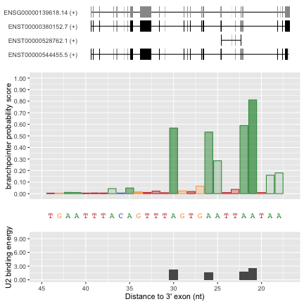
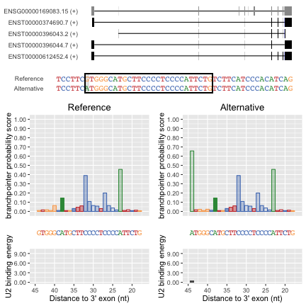

## Branchpointer: prediction of human splicing branchpoint sites

## Introduction

## Preparations

### Download genome annotations

Branchpointer requires a genome annotation derived from a GTF file and the fasta sequence for this genome annotation. We will be using the GENCODE annotation (http://www.gencodegenes.org/releases/current.html) as an example, although others and custom annotatations can be used.

Create or move to a working directory where these files can be stored.
Note that these can be large files (>1GB) when uncompressed

```bash
wget ftp://ftp.sanger.ac.uk/pub/gencode/Gencode_human/release_24/gencode.v24.annotation.gtf.gz
gunzip gencode.v24.annotation.gtf.gz

wget ftp://ftp.sanger.ac.uk/pub/gencode/Gencode_human/release_24/GRCh38.p5.genome.fa.gz
gunzip GRCh38.p5.genome.fa.gz
```

### Read in exon annotations

readExonAnnotation will generate an exon annotation table from a gtf, and save it in the same location
```r
exons <- readExonAnnotation("gencode.v24.annotation.gtf")
```
After this step has been performed once, the exon file can be specified instead to save reformatting the gtf file again.

```r
exons <- readExonAnnotation("gencode.v24.annotation.exons.txt")
```

## Branchpoint predictions

### Read query and calculate location attributes

#### Intronic window queries
Query regions must contain a branchpoint window - that is the region located at -18 to -44 from the 3' splice site. 
Each region given will be treated as only one query, and associated with the closest 3' exon. 
To cover multiple 3'exons, please provide branchpointer with seperate region queries.
For known regions, queries can be supplied as a table:


```r
query_intron <- readQueryFile("intron_example.txt",query_type = "region")

pander::pander(query_intron, row.names=FALSE, split.table=130, style="rmarkdown")
```


|      id      |  chromosome  |  chrom_start  |  chrom_end  |  strand  |
|:------------:|:------------:|:-------------:|:-----------:|:--------:|
| BRCA1_intron |    chr17     |   43106534    |  43106634   |    -     |
| BRCA2_intron |    chr13     |   32376570    |  32376669   |    +     |

Then location information can be retrieved using

```r
query_intron <- getQueryLoc(query_intron,query_type="region",exons = exons)

pander::pander(query_intron, row.names=FALSE, split.table=130, style="rmarkdown")
```


|       &nbsp;       |      id      |  chromosome  |  chrom_start  |  chrom_end  |  strand  |  to_3prime  |  to_5prime  |
|:------------------:|:------------:|:------------:|:-------------:|:-----------:|:--------:|:-----------:|:-----------:|
|  **BRCA1_intron**  | BRCA1_intron |    chr17     |   43106551    |  43106577   |    -     |     18      |    3914     |
|  **BRCA2_intron**  | BRCA2_intron |    chr13     |   32376626    |  32376652   |    +     |     18      |    1246     |

Table: Table continues below

 

|       &nbsp;       |  same_gene  |    exon_3prime    |    exon_5prime    |
|:------------------:|:-----------:|:-----------------:|:-----------------:|
|  **BRCA1_intron**  |    TRUE     | ENSE00003541068.1 | ENSE00001888888.1 |
|  **BRCA2_intron**  |    TRUE     | ENSE00003461148.1 | ENSE00002167182.1 |

For large numbers of queries (>500), it is recomended to use parallelisation to speed up computation.
This can be done by setting `use_parallel=TRUE` and supplying a `cores` number greater than 1 to functions with this argument.
Note that if the number of specified cores is greater than the number available, the maximum number available will be utilised

```r
query_intron <- getQueryLoc(query_intron,query_type="region",exons = exons, use_parallel=TRUE, cores=4)
```

Alternatively, to generate branchpoint window region queries by exon annotations, the exon annotation file can be used:
Note that when searching for genes, transcripts, or exons, the ids used must be in the same format as in the annotation file (i.e ENSG00000XXXXXX, ENST00000XXXXXX, ENSE00000XXXXXX). If you are unsure of a id, aliases can typically be found through ensembl (ensembl.org), or through a biomaRt query.


```r
query_intron_make <- makeRegions("ENSE00003541068.1", "exon_id", exons)

pander::pander(query_intron_make, row.names=FALSE, split.table=130, style="rmarkdown")
```


|        id         |  chromosome  |  chrom_start  |  chrom_end  |  strand  |  to_3prime  |  to_5prime  |  same_gene  |
|:-----------------:|:------------:|:-------------:|:-----------:|:--------:|:-----------:|:-----------:|:-----------:|
| ENSE00003541068.1 |    chr17     |   43106551    |  43106577   |    -     |     18      |    3914     |    TRUE     |

Table: Table continues below

 

|    exon_3prime    |    exon_5prime    |
|:-----------------:|:-----------------:|
| ENSE00003541068.1 | ENSE00001888888.1 |

```r
#or for multiple ids
query_intron_make <- lapply(c("ENSE00003541068.1", "ENSE00003461148.1"), 
                      makeRegions, "exon_id", exons)
                      
query_intron_make <- do.call("rbind", query_intron_make)
```

#### SNP queries

Query SNPs should be located nearby a branchpoint window to have any potential effects on branchpoint architecture
SNP queries can be supplied as a table formatted as follows:


```r
query_snp <- readQueryFile("SNP_example.txt",query_type = "SNP")
```


Alternatively, appropriate attributes can be pulled from biomart when a list of refsnp ids is provided:
```r
mart <- useMart("ENSEMBL_MART_SNP", dataset="hsapiens_snp",host="www.ensembl.org")

query_snp <- snpToQuery(c("rs17000647","rs5031002","rs998731"), mart_snp = mart)
```

By default, all SNPs retrieved will be unstranded, and hence further processing will be done on both strands

Location information can be retrieved using

```r
query_snp <- getQueryLoc(query_snp,query_type="SNP",exons = exons, filter = FALSE)
```
Each SNP will be associated with the closest 3' exon. If SNPs are distal from branchpoint windows, the max_dist argument will remove any greater than the specified distance. 
Filtering prior to exon associations can speed up processing in instances where it is unknown if the majority of SNPs fall nearby branchpoint windows.

Queries can be provided as stranded or unstranded. 
In the case of unstranded queries, any value except `"+"` or `"-"` will cause branchpointer to run on both strands.

### Get sequence attributes for query regions

Sequences covering each site +/- 250 nt are retrieved using bedtools. 
The absolute location of the bedtools binary must be provided for calls from within R.
To find the location of your installed bedtools binary, using the command line type:

```bash
which bedtools
```

If chromosome names in the .fasta genome file do not match those in the query 
(i.e chr1 in query, 1 in .fasta), the argument `rm_chr` should be set to `FALSE`.

This will generate a data.frame with a row for each site (of 27) in branchpoint window regions.
If a SNP query type is provided, this will also perform an in silico mutation of the sequence.

All features required for the model to predict branchpoint probability are contained within this data.frame.

When performing this step for multiple cases simulataneously, 
a unique_id can be provided to prevent incorrect .fasta files being read in during the sequence retreival step.


```r
#for query regions
query_attributes_intron <- getBranchpointSequence(query_intron,
                                        query_type = "region",
                                        genome = "GRCh38.p5.genome.fa",
                                        bedtools_location="/Applications/apps/bedtools2/bin/bedtools")


#for query SNPs
query_attributes_snp <- getBranchpointSequence(query_snp,
                                        query_type = "SNP",
                                        genome = "GRCh38.p5.genome.fa",
                                        bedtools_location="/Applications/apps/bedtools2/bin/bedtools")
```

### Predict branchpoint probabilities 

Probabilities for each site within the window are then evaluated using the branchpointer model.
We reccomend use of the cutoff probability 0.5 to distinguish branchpoints and non-branchpoint sites.
U2 binding energy can be used as a measurement of branchpoint strength when the probability score is above the cutoff.


```r
branchpoint_predictions_intron <- predictBranchpoints(query_attributes_intron)

branchpoints_intron <- branchpoint_predictions_intron[branchpoint_predictions_intron$branchpoint_prob > 0.5,]

pander::pander(head(arrange(branchpoints_intron, plyr::desc(branchpoint_prob))),
               row.names=FALSE, split.table=130, style="rmarkdown")
```


|      id      |  branchpoint_prob  |  nucleotide  |  distance  |  allele_status  |  chromosome  |  strand  |   end    |
|:------------:|:------------------:|:------------:|:----------:|:---------------:|:------------:|:--------:|:--------:|
| BRCA2_intron |       0.8107       |      A       |     21     |       REF       |    chr13     |    +     | 32376649 |
| BRCA2_intron |       0.5898       |      A       |     22     |       REF       |    chr13     |    +     | 32376648 |
| BRCA2_intron |       0.5672       |      A       |     30     |       REF       |    chr13     |    +     | 32376640 |
| BRCA2_intron |       0.5324       |      A       |     26     |       REF       |    chr13     |    +     | 32376644 |
| BRCA1_intron |       0.5093       |      A       |     30     |       REF       |    chr17     |    -     | 43106563 |

Table: Table continues below

 

|    exon_3prime    |    exon_5prime    |  U2_binding_energy  |
|:-----------------:|:-----------------:|:-------------------:|
| ENSE00003461148.1 | ENSE00002167182.1 |         2.5         |
| ENSE00003461148.1 | ENSE00002167182.1 |         1.8         |
| ENSE00003461148.1 | ENSE00002167182.1 |         2.2         |
| ENSE00003461148.1 | ENSE00002167182.1 |         1.6         |
| ENSE00003541068.1 | ENSE00001888888.1 |         0.1         |


```r
branchpoint_predictions_snp <- predictBranchpoints(query_attributes_snp)

snp_stats <- predictionsToStats(branchpoint_predictions_snp, query_snp)

pander::pander(snp_stats, row.names=FALSE, split.table=130, style="rmarkdown")
```


| &nbsp;  |       id       |  chromosome  |  chrom_start  |  strand  |  ref_allele  |  alt_allele  |  BP_num_REF  |
|:-------:|:--------------:|:------------:|:-------------:|:--------:|:------------:|:------------:|:------------:|
|  **1**  | rs17000647_pos |     chr4     |   75556520    |    +     |      C       |      A       |      4       |
|  **2**  | rs5031002_pos  |     chrX     |   67722783    |    +     |      G       |      A       |      0       |
|  **6**  |  rs998731_neg  |     chr8     |   80183160    |    -     |      C       |      T       |      1       |

Table: Table continues below

 

| &nbsp;  |  BP_num_ALT  |  deleted_n  |  created_n  |  dist_to_exon  |  dist_to_BP_REF  |  dist_to_BP_ALT  |
|:-------:|:------------:|:-----------:|:-----------:|:--------------:|:----------------:|:----------------:|
|  **1**  |      3       |      1      |      0      |       21       |        -1        |        -1        |
|  **2**  |      1       |      0      |      1      |       44       |        NA        |        0         |
|  **6**  |      2       |      0      |      1      |       22       |        -4        |        0         |

Table: Table continues below

 

| &nbsp;  |  max_prob_REF  |  max_prob_ALT  |  max_U2_REF  |  max_U2_ALT  |
|:-------:|:--------------:|:--------------:|:------------:|:------------:|
|  **1**  |     0.9711     |     0.8713     |     6.5      |      3       |
|  **2**  |     0.4563     |     0.6564     |      NA      |     0.5      |
|  **6**  |     0.6077     |     0.7966     |     0.5      |     1.6      |

The window scores can be plotted using plotBranchpointWindow(), with optional plots for gene and isoform structure.
The main panel displays the probability scores of each site within the branchpoint window. The opacity of the bars is representitive of relative U2 binding energy (darker = stronger), and the lower panel shows U2 binding energy for all sites above the provided proabability cutoff.

#### Branchpoint predictions in an intronic window

BRCA2 intron (ENSE00002167182.1 - ENSE00003461148.1).

```r
plotBranchpointWindow(query_intron$id[2], branchpoint_predictions_intron,query_attributes_intron,
                      probability_cutoff = 0.5,plot_mutated = F,
                      plot_structure = T,exons = exons)
```



#### Branchpoint predictions in reference and alternative sequence

[rs17000647](http://www.ebi.ac.uk/gwas/search?query=rs17000647) in C4orf26 intron 1.

```r
plotBranchpointWindow(query_snp$id[2], branchpoint_predictions_snp,query_attributes_snp,
                      probability_cutoff = 0.5,plot_mutated = T,
                      plot_structure = T,exons = exons)
```



## Output table column descriptions

Several data.frames are created and used to predict branchpoints using branchpointer.

### getQueryLoc

|column name |description |
|:-----------|:----------------------------------------------------------------|
|id | identifier for query |
|chromosome | chromosome name (i.e. chr1) |
|chrom_start | chromosome location of the start of the window (for region), or location of the SNP (for SNP) |
|chrom_end | chromosome location of the end of the window (for region). Not included for SNP queries. |
|strand | chromosome strand |
|to_3prime | distance (in nucleotides) to the closest annotated 3' exon |
|to_5prime | distance (in nucleotides) to the closest annotated 5' exon |
|same_gene | (boolean) are the closest 3' and 5' exons from the same parent gene? |
|exon_3prime | exon_id of the closest annotated 3' exon |
|exon_5prime | exon_id of the closest annotated 5' exon |

### getBranchpointSequence

|column name |description |
|:-----------|:----------------------------------------------------------------|
|id | identifier for site-specific query (id+to_3prime+REF/ALT) |
|chromosome | chromosome name (i.e. chr1) |
|end | chromosome location of the site specific query |
|strand | chromosome strand |
|seq | RNA sequence covering the 501 nucletides surrounding the site |
|exon_3prime | exon_id of the closest annotated 3' exon |
|exon_5prime | exon_id of the closest annotated 5' exon |
|to_3prime | distance (in nucleotides) to the closest annotated 3' exon |
|to_5prime | distance (in nucleotides) to the closest annotated 5' exon |
|ppt_start | distance (in nucleotides) to the polypyrimidine tract |
|ppt_run_length | length of the polypyrimidine tract |
|canon_hit1 | distance (in nucleotides) to the 1st AG dinucleotide |
|canon_hit2 | distance (in nucleotides) to the 2nd AG dinucleotide |
|canon_hit3 | distance (in nucleotides) to the 3rd AG dinucleotide |
|canon_hit4 | distance (in nucleotides) to the 4th AG dinucleotide |
|canon_hit5 | distance (in nucleotides) to the 5th AG dinucleotide |
|seq_neg5 | sequence identity of the nucletide -5nt from the tested site |
|seq_neg4 | sequence identity of the nucletide -4nt from the tested site |
|seq_neg3 | sequence identity of the nucletide -3nt from the tested site |
|seq_neg2 | sequence identity of the nucletide -2nt from the tested site |
|seq_neg1 | sequence identity of the nucletide -1nt from the tested site |
|seq_pos0 | sequence identity of the tested site |
|seq_pos1 | sequence identity of the nucletide +1nt from the tested site |
|seq_pos2 | sequence identity of the nucletide +2nt from the tested site |
|seq_pos3 | sequence identity of the nucletide +3nt from the tested site |
|seq_pos4 | sequence identity of the nucletide +4nt from the tested site |
|seq_pos5 | sequence identity of the nucletide +5nt from the tested site |

### predictBranchpoints

|column name |description |
|:-----------|:----------------------------------------------------------------|
|id | identifier for query |
|branchpoint_prob | branchpoint probability score |
|nucleotide | nuceotide at tested site |
|distance | distance (in nucleotides) to the closest annotated 3' exon |
|allele_status | REF (reference sequence) or ALT (alternative sequence) |
|chromosome | chromosome name (i.e. chr1) |
|strand | chromosome strand |
|end | chromosome location of the site specific query |
|exon_3prime | exon_id of the closest annotated 3' exon |
|exon_5prime | exon_id of the closest annotated 5' exon |
|U2_binding_energy | binding energy of the sequence surrounding the testing site to the U2 snRNA |

### predictionsToStats

|column name |description |
|:-----------|:----------------------------------------------------------------|
|id | identifier for query |
|chromosome | chromosome name (i.e. chr1) |
|chrom_start | chromosome location of the SNP |
|strand | chromosome strand |
|ref_allele | nucleotide identity of the reference allele |
|alt_allele | nucleotide identity of the alternative allele |
|BP_num_REF | number of branchpoints in the tested window with the reference sequence |
|BP_num_ALT | number of branchpoints in the tested window with the alternative sequence |
|deleted_n | number of branchpoints that become deleted in the alternative sequence |
|created_n | number of branchpoints that become created in the alternative sequence |
|dist_to_exon | distance (in nucleotides) to the closest annotated 3' exon |
|dist_to_BP_REF | distance (in nucleotides) to the closest branchpoint in the reference sequence |
|dist_to_BP_ALT | distance (in nucleotides) to the closest branchpoint in the alternative sequence |
|max_prob_REF | maximum branchpoint probability score in the reference sequence |
|max_prob_ALT | maximum branchpoint probability score in the alternative sequence |
|max_U2_REF | maximum U2 binding energy of predicted branchpoints in the reference sequence (NA if no branchpoints) |
|max_U2_ALT | maximum U2 binding energy of predicted branchpoints in the alternative sequence (NA if no branchpoints) |
